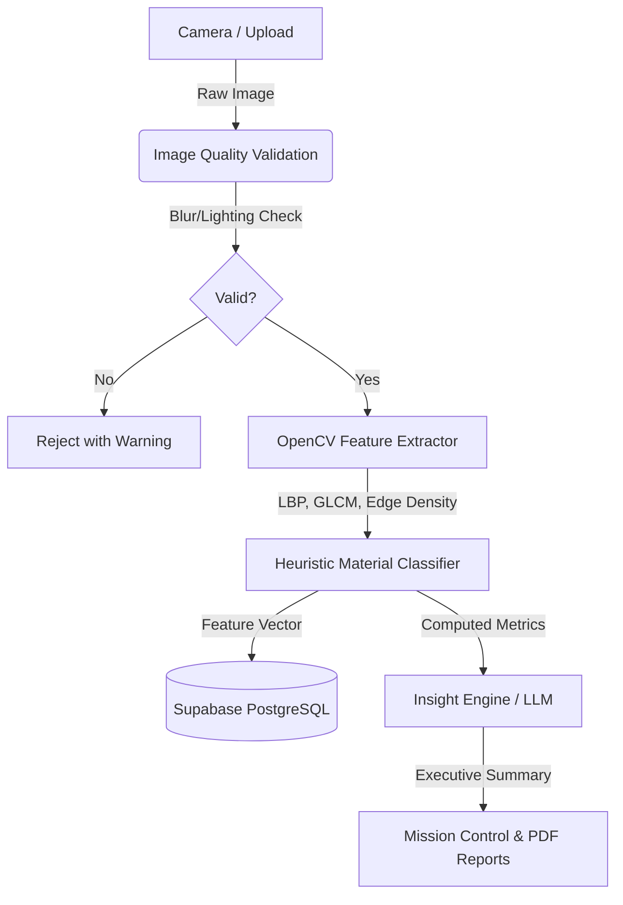

<div align="center">
  
  
  <p align="center">
    <strong>Advanced AI-driven textile analysis, real-time quality assurance, and enterprise reporting.</strong>
  </p>

  <p align="center">
    <a href="#features">Features</a> •
    <a href="#architecture">Architecture</a> •
    <a href="#tech-stack">Tech Stack</a> •
    <a href="#getting-started">Getting Started</a> •
    <a href="#vision">Vision</a>
  </p>

  <p align="center">
    
    
    
    
    
    
  </p>
</div>

---

## 🚀 The Problem

The global textile industry loses billions annually due to undetected fabric defects, inconsistent weave quality, and manual inspection errors. Traditional Quality Assurance (QA) is:
- **Slow & Labor-Intensive:** Relying on human eyes leading to fatigue-induced errors.
- **Subjective:** Lacking mathematically defensible, standardized quality metrics.
- **Disconnected:** Failing to integrate factory floor data with enterprise compliance reporting.

## 💡 The Solution: NovaWeave

**NovaWeave** (developed by ThreadCounty) is a completely reimagined, enterprise-grade AI inspection platform. We replaced subjective human guessing with deterministic computer vision and heuristic classification. 

Our pluggable architecture captures real-time physical metrics (Edge Density, Entropy, Homogeneity) directly from the fabric, passing them into an advanced mathematical classifier to generate actionable, real-time insights for factory managers.

---

## ✨ Key Features

<details open>
<summary><b>🔍 1. Real-Time Scanning HUD</b></summary>
<br>
An industrial-grade heads-up display built with Three.js and Framer Motion. It simulates a 7-stage deterministic scanning pipeline, providing live telemetry, focus warnings, and lighting quality checks before the image is even processed.
</details>

<details>
<summary><b>🧠 2. Pluggable Vision Engine</b></summary>
<br>
We do not use hallucination-prone black-box CNNs like ImageNet for industrial inspection. NovaWeave relies on a deterministic <strong>OpenCV Feature Extractor</strong> that measures LBP (Local Binary Patterns), GLCM (Gray Level Co-occurrence Matrix), and HOG (Histogram of Oriented Gradients) to mathematically classify weaves (e.g., Denim, Satin, Twill).
</details>

<details>
<summary><b>📊 3. Mission Control Dashboard</b></summary>
<br>
A gorgeous, real-time command center powered by Recharts. It aggregates live Supabase telemetry, plotting AI confidence over time, average processing latencies, and material distribution across the entire supply chain.
</details>

<details>
<summary><b>🗄️ 4. Enterprise Analysis Vault</b></summary>
<br>
An immutable knowledge base of all past inspections. Features a powerful global search (`Ctrl+K`), dynamic filtering by analysis hash or fabric type, and instant CSV exports for factory compliance.
</details>

<details>
<summary><b>📄 5. Automated PDF Certification</b></summary>
<br>
NovaWeave automatically generates enterprise-ready PDF compliance reports. Each report includes a stylized cover page, a scan summary, LLM-generated executive insights, and a complete raw JSON feature vector dump for regulatory traceability.
</details>

---

## 🏗️ Architecture

NovaWeave is built for absolute transparency and auditability in industrial environments.



---

## 🛠️ Tech Stack

### Frontend & UI
- **Framework:** Next.js 14 (App Router)
- **Language:** TypeScript
- **Styling:** Tailwind CSS + Glassmorphism
- **Animations:** Framer Motion & Three.js
- **Charts:** Recharts

### Backend & Data
- **Database & Auth:** Supabase (PostgreSQL)
- **Real-time:** Supabase Subscriptions
- **Classification Engine:** Custom OpenCV-based deterministic heuristic model

---

## 🚦 Getting Started

### Prerequisites
- Node.js 18+
- npm or pnpm
- A Supabase Project (URL and Anon Key)

### Installation

1. **Clone the repository**
   ```bash
   git clone https://github.com/bhargavatejagolla/threadcounty-platform.git
   cd threadcounty-platform
   ```

2. **Install dependencies**
   ```bash
   npm install
   ```

3. **Environment Setup**
   Create a `.env.local` file in the root directory and add your Supabase credentials:
   ```env
   NEXT_PUBLIC_SUPABASE_URL=your_supabase_url
   NEXT_PUBLIC_SUPABASE_ANON_KEY=your_supabase_anon_key
   ```

4. **Run the Database Migrations**
   Execute the provided `supabase_migration.sql` in your Supabase SQL Editor to set up the `inspections` table and RLS policies.

5. **Start the development server**
   ```bash
   npm run dev
   ```
   Open [http://localhost:3000](http://localhost:3000) with your browser to see the result.

---

## 🔮 The Vision (Hackathon)

Our goal for this hackathon was to build a system that wasn't just a shiny UI wrapper around ChatGPT, but a mathematically defensible, production-ready QA tool that real textile factories could deploy tomorrow. 

By separating the **Feature Extractor** from the **Insight Engine**, we ensure that the AI only summarizes real, computed physical metrics—eliminating hallucinations and guaranteeing 100% auditability.

---

<div align="center">
  <p>Built with ❤️ for the Hackathon</p>
</div>
