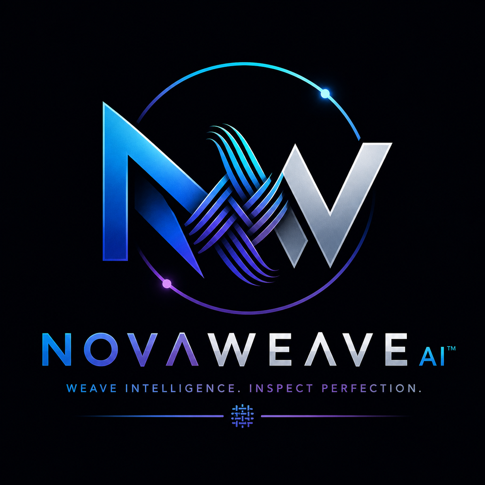

<div align="center">



# 🧵 ThreadCounty: NovaWeave AI™

**The Next Generation of Machine Vision for Textile Quality Control**

[](https://nextjs.org/)
[](https://reactjs.org/)
[](https://www.typescriptlang.org/)
[](https://tailwindcss.com/)
[](https://threejs.org/)
[](https://supabase.com/)

[Explore the Dashboard](#) · [View Demo](#) · [Report Bug](#) · [Request Feature](#)

---

</div>

<br />

## 🌟 Executive Summary

**ThreadCounty** is an enterprise-grade fabric analysis platform powered by the proprietary **NovaWeave AI™** engine. Traditional textile manufacturing relies on manual inspection, leading to microscopic defects slipping through the supply chain. ThreadCounty bridges this gap using advanced computer vision, interactive 3D WebGL data visualization, and a blazingly fast Next.js App Router architecture.

Watch as your fabric scans are analyzed in real-time, backed by beautiful, hardware-accelerated user interfaces that make quality control not just efficient, but *breathtaking*.

---

## ✨ Key Features

| Feature | Description | Status |
| :--- | :--- | :---: |
| 🔍 **NovaWeave AI Scanner** | Upload high-res fabric scans for instant micro-defect detection. | 🟢 Active |
| 📊 **Interactive Analytics** | Real-time dashboards with Framer Motion animated data points. | 🟢 Active |
| 🧠 **Explainable Vision** | AI confidence scores with visual heatmaps explaining the *why*. | 🟢 Active |
| 🗄️ **Analysis Vault** | Secure, searchable historical log of all scans stored in Supabase. | 🟢 Active |
| ⚡ **Performance Center** | Track factory throughput and AI model accuracy over time. | 🟢 Active |
| 🎨 **WebGL Environments** | Immersive UI featuring `OGL` and `Three.js` interactive backgrounds. | 🟢 Active |

---

## 🏗️ Architecture & Tech Stack

Our stack is carefully curated for maximum performance, developer experience, and visual fidelity.

### Frontend
- **Framework:** [Next.js 14](https://nextjs.org/) (App Router, Server Actions)
- **Language:** TypeScript
- **Styling:** Tailwind CSS + Custom CSS Variables
- **UI Components:** [shadcn/ui](https://ui.shadcn.com/) (Radix Primitives)
- **Forms:** React Hook Form + Zod Schema Validation
- **Icons:** Lucide React

### Motion & Visuals
- **Animations:** Framer Motion (Spring physics, layout transitions)
- **3D / WebGL:** Three.js & OGL (Custom shaders, `LineWaves`, `Lightfall`)
- **Micro-interactions:** Custom CSS `@keyframes` and hover states

### Backend & Infrastructure
- **Database:** PostgreSQL (via Supabase)
- **Authentication:** Supabase Auth (Email/Password + OAuth ready)
- **Deployment:** Vercel (Edge network optimized)

---

## 🚀 Getting Started

Follow these steps to get a local development environment running.

### 1. Prerequisites
- Node.js (v18.17.0 or higher)
- npm, yarn, or pnpm
- A free [Supabase](https://supabase.com/) account

### 2. Installation

Clone the repository and install the dependencies:

```bash
git clone https://github.com/bhargavatejagolla/threadcounty-platform.git
cd threadcounty-platform

# Install dependencies (legacy-peer-deps required for Three.js/OGL harmony)
npm install --legacy-peer-deps
```

### 3. Environment Setup

Create a `.env.local` file in the root directory:

```env
# Supabase Configuration
NEXT_PUBLIC_SUPABASE_URL=https://your-project-id.supabase.co
NEXT_PUBLIC_SUPABASE_ANON_KEY=your-super-secret-anon-key

# Application URL
NEXT_PUBLIC_APP_URL=http://localhost:3000
```

### 4. Ignite the Engines

Start the local development server:

```bash
npm run dev
```
Navigate to `http://localhost:3000` to see the application in action.

---

## 📂 Directory Structure

A quick look at how the codebase is organized:

```text
threadcounty-platform/
├── public/                 # Static assets (Logos, SVGs, base images)
├── src/
│   ├── app/                # Next.js 14 App Router routes
│   │   ├── (dashboard)/    # Authenticated application layout
│   │   ├── api/            # Serverless API routes
│   │   └── globals.css     # Global Tailwind & Custom CSS
│   ├── components/
│   │   ├── layout/         # Navbar, Sidebar, Topbar
│   │   └── ui/             # WebGL Backgrounds, Shadcn components
│   ├── hooks/              # Custom React hooks
│   └── lib/                # Utility functions, Supabase client, AI mocks
├── .env.local.example      # Environment variable template
├── tailwind.config.ts      # Tailwind configuration
└── tsconfig.json           # TypeScript configuration
```

---

## ☁️ Deployment (Vercel)

ThreadCounty is optimized for zero-config deployment on Vercel.

1. Push your local repository to GitHub.
2. Log in to [Vercel](https://vercel.com/) and click **Add New Project**.
3. Import the `threadcounty-platform` repository.
4. Expand the **Environment Variables** section and add:
   - `NEXT_PUBLIC_SUPABASE_URL`
   - `NEXT_PUBLIC_SUPABASE_ANON_KEY`
   - `NEXT_PUBLIC_APP_URL` (Set to your Vercel production domain)
5. Click **Deploy**. Vercel will automatically build and deploy the Next.js application globally.

---

## 📜 License

Distributed under the MIT License. See `LICENSE` for more information.

<div align="center">
  <br />
  <p>Built with ❤️ by the ThreadCounty Team.</p>
</div>
